# 🇬🇧 İzlemeli Nuvio Home Catalog Addon and Collections

## 🎬 İzlemeli Nuvio Home Catalog Addon

A Nuvio home catalog addon for discovering movies and TV series through different categories, genres, themes, interests and collections.

This addon is **not a streaming or video playback addon**. It only provides catalog and collection listings.

## 📚 Catalogs

### ⭐ Featured

- Recommended Titles
- Currently Popular
- Highest IMDb Rated
- Most Voted
- New Releases
- ...+ and more

### 🎭 Genres

- Action
- Adventure
- Comedy
- Crime
- ...+ and more

### 🎯 Themes & Interests

- Based on True Stories
- Zombies
- Space
- Aliens
- Time Travel
- Time Loops
- Parallel Universes
- Artificial Intelligence
- ...+ and more

The catalog is not limited to these categories. More themes and interests are available.

### ⭐ İzlemeli.com Recommendations

For users asking “What should I watch?”, titles recommended and published on İzlemeli.com can be discovered through the addon.

> Have a movie or series you think everyone should watch? Send it to İzlemeli.com.

## 📦 Collections

Collections provide a deeper browsing structure than individual catalogs.

They include platforms, genres, themes, Turkish content, language-based sections and different movie/series categories.

Collections are organized into folders and sub-sections such as:

- **Platforms:** Netflix, Disney+, Prime Video, HBO Max, Apple TV+
- **New & Popular:** New, Currently Popular, Highest IMDb Rated
- **Genres:** Action, Adventure, Animation, Comedy, Crime, Documentary, Drama, Family, Fantasy, History, Horror, Music, Mystery, Romance, Science Fiction, Thriller, War, Western
- **Themes & Interests:** Space, Aliens, Time Travel, Parallel Universes, Artificial Intelligence, Robots, Zombies, Vampires, Werewolves, Ghosts, Demons, Heists, Mafia, Serial Killers, Spies, Vikings, Samurai, Pirates, WWII, Superheroes, Video Games, Book Adaptations and more
- **Turkish Content:** Turkish Movies and Turkish TV Series
- **Languages:** Turkish and English

Collections include separate sections for movies and series where applicable, with categories such as New, Popular, Top Rated and genres.

This collection does not replace the catalog addon. Catalogs and collections can be used together.

Collections and catalogs are continuously updated.

## 🌍 Languages

The addon is available in:

- English
- Turkish

English manifest:

https://izlemeli.github.io/nuvio/en/manifest.json

Turkish manifest:

https://izlemeli.github.io/nuvio/tr/manifest.json

## 📚 Catalog Installation

1. Open Nuvio.
2. Go to **Settings → Add-ons**.
3. Add an addon using the manifest URL.
4. Paste the manifest URL.
5. Install the addon.
6. Catalogs will become available on the Nuvio home screen.

### 📱 Installation Screenshots

  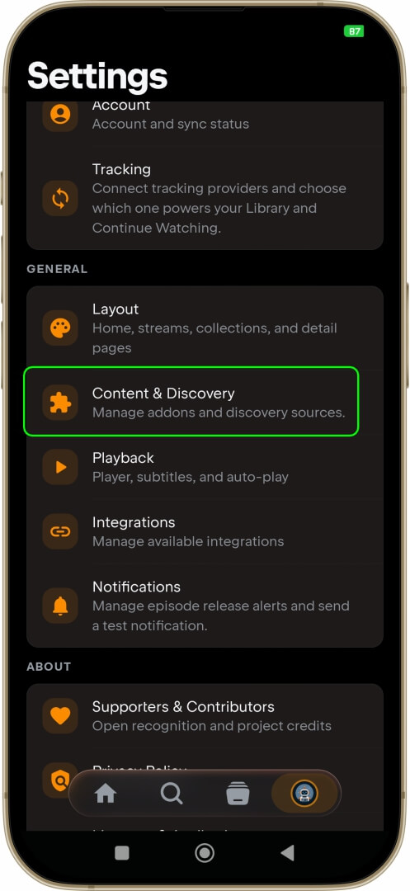
  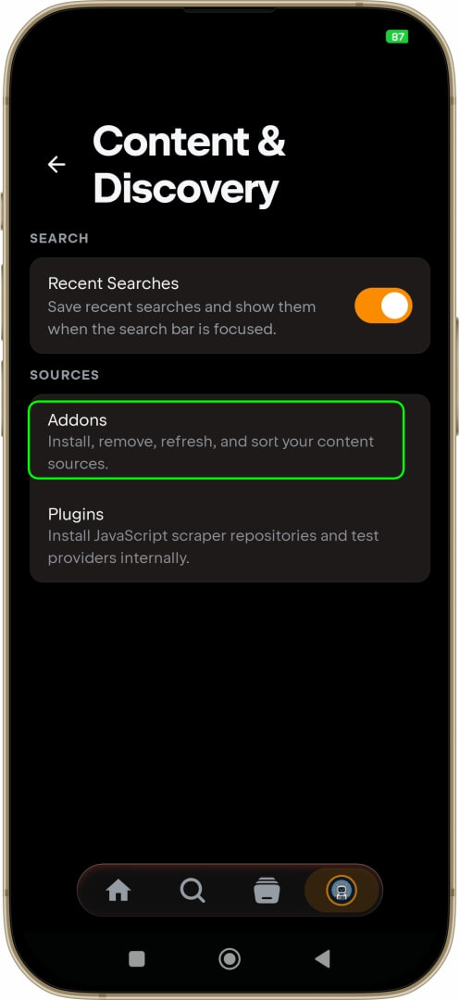
  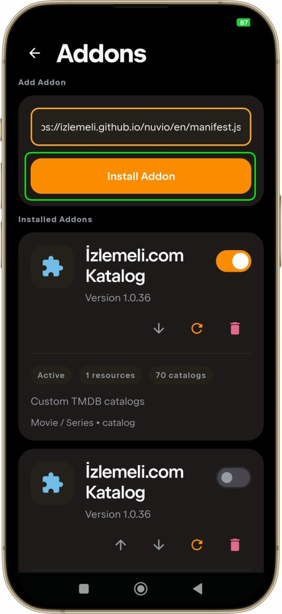

## 📦 Collection Installation

Collections can be imported through **nuvio.tv**.

1. Open https://nuvio.tv/
2. Sign in to your Nuvio account.
3. Go to **Account → Collections**.
4. Select **Import**.
5. Open the collection JSON link below.
6. Copy the full JSON content.
7. Paste it into the import field.
8. Confirm the import.
9. The collection will be added to your account and synced with Nuvio.

### 🇬🇧 English Collection

https://raw.githubusercontent.com/izlemeli/nuvio/refs/heads/main/collections-en.json

### 🇹🇷 Turkish Collection

https://raw.githubusercontent.com/izlemeli/nuvio/refs/heads/main/collections.json

## 📸 Screenshots

  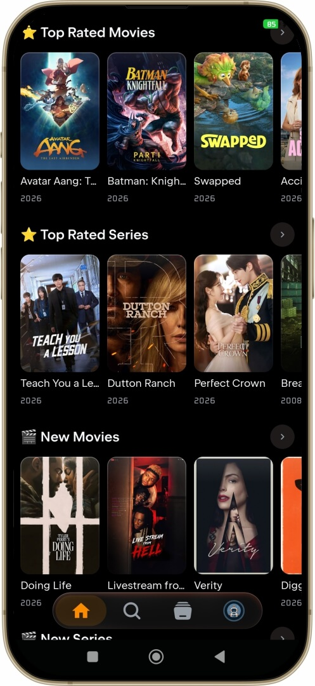
  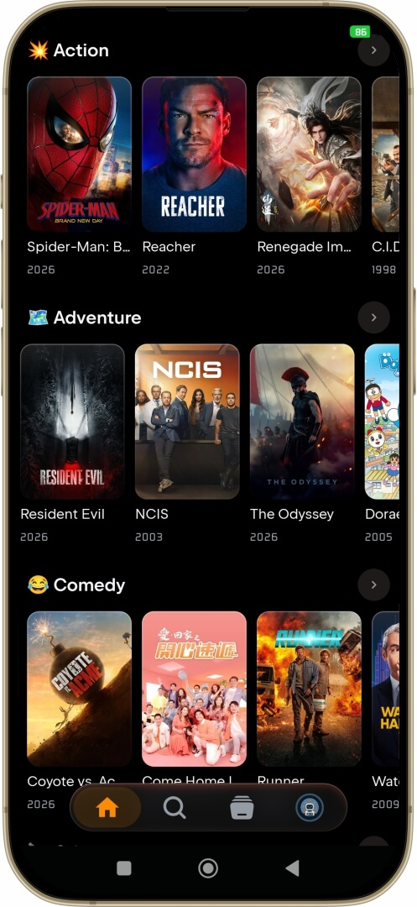
  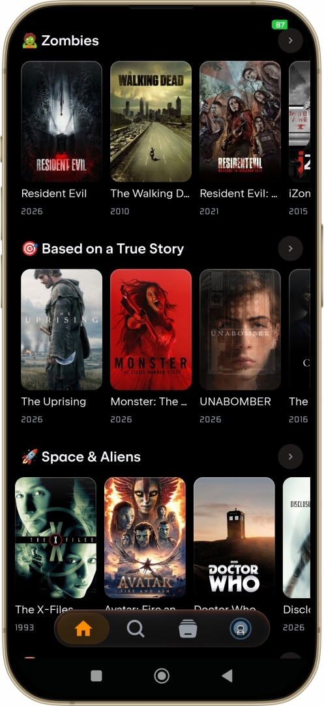

## 🔗 Links

- Website: https://www.izlemeli.com/
- GitHub: https://github.com/izlemeli/nuvio
- English Manifest: https://izlemeli.github.io/nuvio/en/manifest.json
- Turkish Manifest: https://izlemeli.github.io/nuvio/tr/manifest.json
- English Collections: https://raw.githubusercontent.com/izlemeli/nuvio/refs/heads/main/collections-en.json
- Turkish Collections: https://raw.githubusercontent.com/izlemeli/nuvio/refs/heads/main/collections.json

> It is recommended to use this plugin together with Nuvio's original catalog plugin. Nuvio's main catalog metadata helps smoother content matching.

---

# 🇹🇷 İzlemeli Nuvio Anasayfa Kataloğu Eklentisi ve Koleksiyonlar

## 🎬 İzlemeli Nuvio Anasayfa Kataloğu Eklentisi

Film ve dizileri farklı kategoriler, türler, temalar, ilgi alanları ve koleksiyonlar üzerinden keşfetmeyi sağlayan Nuvio anasayfa kataloğu eklentisidir.

Bu eklenti **yayın veya video oynatma eklentisi değildir**. Yalnızca katalog ve koleksiyon listeleri sağlar.

## 📚 Kataloglar

### ⭐ Öne Çıkanlar

- Önerilen Yapımlar
- Şu An Popüler
- IMDb En Yüksek Puanlı
- En Çok Oy Alan
- Yeni Çıkanlar
- ...+ ve daha fazlası

### 🎭 Türler

- Aksiyon
- Macera
- Komedi
- Suç
- ...+ ve daha fazlası

### 🎯 Temalar & İlgi Alanları

- Gerçek Hikâyelerden Esinlenenler
- Zombi
- Uzay
- Uzaylılar
- Zaman Yolculuğu
- Zaman Döngüsü
- Paralel Evrenler
- Yapay Zekâ
- ...+ ve daha fazlası

Katalog yalnızca bu kategorilerle sınırlı değildir. Daha fazla tema ve ilgi alanı bulunmaktadır.

### ⭐ İzlemeli.com Önerileri

“Ne izlemeli?” sorusuna cevap arayan kullanıcılar için İzlemeli.com'da önerilen ve yayınlanan film ve diziler eklenti üzerinden keşfedilebilir.

> Herkesin izlemesi gerektiğini düşündüğünüz bir film veya dizi mi var? İzlemeli.com'a gönderin.

## 📦 Koleksiyonlar

Koleksiyonlar, tekil kataloglardan daha detaylı bir gezinme yapısı sunar.

Platformlar, türler, temalar, Türkçe içerikler, dil seçenekleri ve farklı film/dizi kategorileri klasörler ve alt bölümler halinde düzenlenmiştir.

Koleksiyonlarda örnek olarak:

- **Platformlar:** Netflix, Disney+, Prime Video, HBO Max, Apple TV+
- **Yeni & Popüler:** Yeni, Şu An Popüler, IMDb En Yüksek Puanlı
- **Türler:** Aksiyon, Macera, Animasyon, Komedi, Suç, Belgesel, Dram, Aile, Fantastik, Tarih, Korku, Müzik, Gizem, Romantik, Bilim Kurgu, Gerilim, Savaş, Vahşi Batı
- **Temalar & İlgi Alanları:** Uzay, Uzaylılar, Zaman Yolculuğu, Paralel Evrenler, Yapay Zekâ, Robotlar, Zombi, Vampirler, Kurt Adamlar, Hayaletler, Şeytanlar, Soygunlar, Mafya, Seri Katiller, Casuslar, Vikingler, Samuraylar, Korsanlar, II. Dünya Savaşı, Süper Kahramanlar, Video Oyunları, Kitap Uyarlamaları ve daha fazlası
- **Türkçe İçerikler:** Türk Filmleri ve Türk Dizileri
- **Diller:** Türkçe ve İngilizce

Koleksiyonlarda uygun bölümlerde film ve diziler ayrı olarak listelenir; Yeni, Popüler, En Yüksek Puanlı ve türlere göre alt kategoriler bulunur.

Bu koleksiyon katalog eklentisinin yerine geçmez. Kataloglar ve koleksiyonlar birlikte kullanılabilir.

Kataloglar ve koleksiyonlar sürekli olarak güncellenmektedir.

## 🌍 Dil Seçenekleri

Eklenti:

- İngilizce
- Türkçe

dil seçenekleriyle kullanılabilir.

İngilizce manifest:

https://izlemeli.github.io/nuvio/en/manifest.json

Türkçe manifest:

https://izlemeli.github.io/nuvio/tr/manifest.json

## 📚 Katalog Kurulumu

1. Nuvio'yu açın.
2. **Ayarlar → Eklentiler** bölümüne girin.
3. Manifest URL kullanarak eklenti ekleyin.
4. Manifest URL'sini yapıştırın.
5. Eklentiyi yükleyin.
6. Kataloglar Nuvio anasayfasında kullanılabilir hale gelecektir.

### 📱 Kurulum Ekran Görüntüleri

  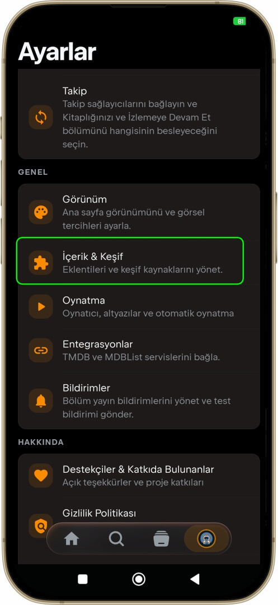
  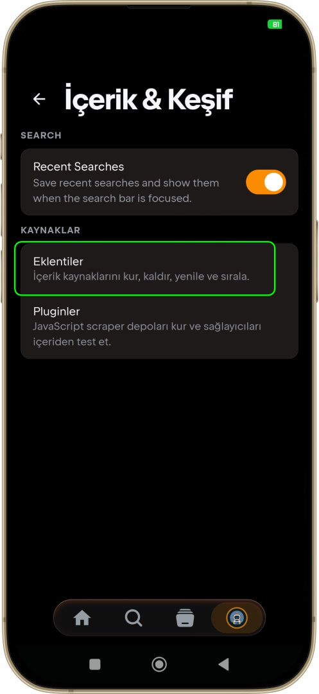
  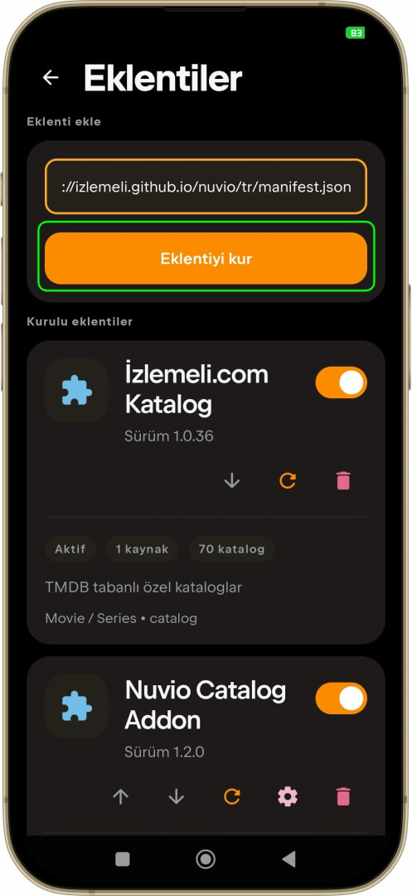

## 📦 Koleksiyon Kurulumu

Koleksiyonlar **nuvio.tv** üzerinden içe aktarılabilir.

1. https://nuvio.tv/ adresini açın.
2. Nuvio hesabınızla giriş yapın.
3. **Account → Collections** bölümüne girin.
4. **Import** seçeneğini açın.
5. Aşağıdaki koleksiyon JSON bağlantısını açın.
6. JSON içeriğinin tamamını kopyalayın.
7. Import alanına yapıştırın.
8. İçe aktarmayı onaylayın.
9. Koleksiyon hesabınıza eklenir ve Nuvio ile senkronize edilir.

### 🇹🇷 Türkçe Koleksiyon

https://raw.githubusercontent.com/izlemeli/nuvio/refs/heads/main/collections.json

### 🇬🇧 İngilizce Koleksiyon

https://raw.githubusercontent.com/izlemeli/nuvio/refs/heads/main/collections-en.json

## 📸 Ekran Görüntüleri

  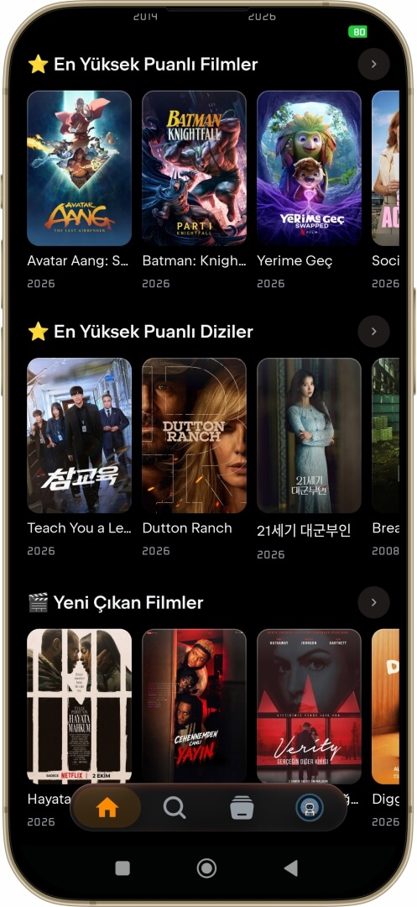
  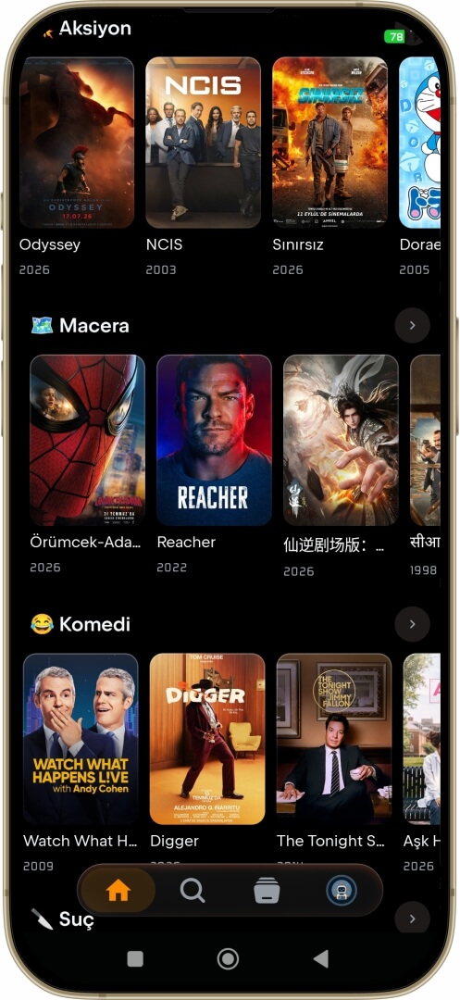
  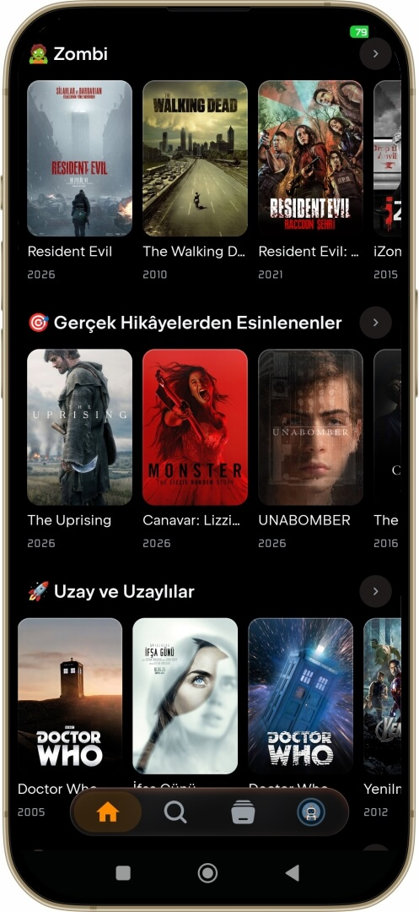

## 🔗 Bağlantılar

- Web sitesi: https://www.izlemeli.com/
- GitHub: https://github.com/izlemeli/nuvio
- İngilizce Manifest: https://izlemeli.github.io/nuvio/en/manifest.json
- Türkçe Manifest: https://izlemeli.github.io/nuvio/tr/manifest.json
- İngilizce Koleksiyonlar: https://raw.githubusercontent.com/izlemeli/nuvio/refs/heads/main/collections-en.json
- Türkçe Koleksiyonlar: https://raw.githubusercontent.com/izlemeli/nuvio/refs/heads/main/collections.json

> Bu eklentinin Nuvio'nun orijinal katalog eklentisiyle birlikte kullanılması önerilir. Nuvio'nun ana katalog metadata'sı içerik eşleşmelerinin daha sorunsuz çalışmasına yardımcı olur.
